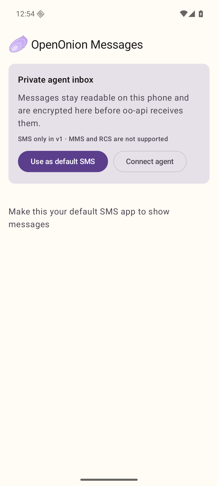

# OpenOnion Messages

Encrypted SMS for you and your AI agents.

OpenOnion Messages is an open-source Kotlin Android SMS app. After the owner
makes it the default SMS app and explicitly pairs a ConnectOnion agent,
incoming SMS messages are encrypted on the phone for that agent and uploaded to
its ciphertext-only `oo-api` inbox.

The server cannot read the sender or body. Decryption happens inside the target
ConnectOnion agent runtime. SMS content is always returned as untrusted data;
receiving a message never authorizes an agent action.

<p align="center">
  
</p>

## v1 capabilities

- local SMS inbox and human-initiated SMS sending;
- Android default SMS role on Android 8.0 and later;
- one-time, expiring Agent pairing links;
- on-device libsodium sealed-box encryption to a ConnectOnion address;
- encrypted offline queue with idempotent, at-least-once delivery;
- revocable device credentials protected by Android Keystore; and
- Agent tools to create a pairing, read, wait for, acknowledge, and decrypt SMS.

OpenOnion Messages v1 does **not** support MMS or RCS, retroactively upload old
messages, let an Agent send SMS, parse OTPs, or implement authentication
workflows. See [Product boundaries](docs/product-boundaries.md).

## How it works

```text
Android phone                    oo-api                     Agent runtime
SMS plaintext ── sealed box ──▶ ciphertext inbox ──▶ local private-key decrypt
      ▲                    server sees routing metadata only             │
      └──────────────────────── human-visible inbox ◀────────────────────┘
```

1. In the Agent project, create a one-time link with
   `create_sms_pairing()`.
2. Install OpenOnion Messages, make it the default SMS app, and paste the link.
3. New inbound SMS is stored in Android's SMS provider, encrypted on-device,
   queued, and uploaded when the network is available.
4. The Agent calls `get_sms()` or `wait_for_sms()`; ConnectOnion fetches the
   ciphertext and decrypts it with that project's identity.

See [Setup](docs/setup.md), [Architecture](docs/architecture.md), the frozen
[v1 encryption protocol](docs/encryption-protocol.md), and the
[Threat model](docs/threat-model.md).

## Build and verify

Requirements: JDK 17 and Android SDK 36.

```bash
./gradlew test lint assembleDebug assembleRelease
./gradlew connectedDebugAndroidTest  # API 26+ emulator or device
```

Release builds are minified and require an external signing step. See
[Releasing](docs/releasing.md). Never commit a keystore or its credentials.

## Repositories

- [`openonion/openonion-messages-android`](https://github.com/openonion/openonion-messages-android) — this Android endpoint
- [`openonion/oo-api`](https://github.com/openonion/oo-api) — ciphertext inbox and device authorization
- [`openonion/connectonion`](https://github.com/openonion/connectonion) — Agent identity, local decryption, and SMS tools

## Privacy and security

Read [Privacy](PRIVACY.md), [Data safety](DATA_SAFETY.md), and
[Security policy](SECURITY.md). Report vulnerabilities privately to
`security@openonion.ai` and never attach real messages or credentials.

## License

Apache License 2.0. See [LICENSE](LICENSE).
