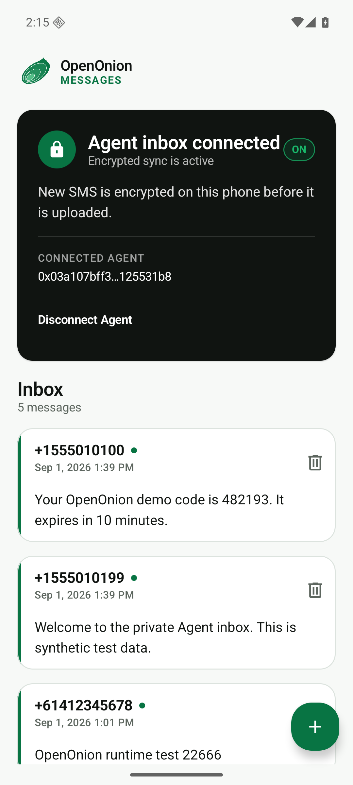

# OpenOnion Messages

Encrypted SMS for you and your AI agents.

[](https://github.com/openonion/openonion-messages-android/actions/workflows/android.yml)
[](https://github.com/openonion/openonion-messages-android/actions/workflows/release.yml)
[](https://github.com/openonion/openonion-messages-android/releases/latest)
[](LICENSE)

OpenOnion Messages is an open-source Kotlin Android SMS app. After the owner
makes it the default SMS app and explicitly pairs a ConnectOnion agent,
incoming SMS messages are encrypted on the phone for that agent and uploaded to
its ciphertext-only `oo-api` inbox.

The server cannot read the sender or body. Decryption happens inside the target
ConnectOnion agent runtime. SMS content is always returned as untrusted data;
receiving a message never authorizes an agent action.

<p align="center">
  
</p>

## Download

Download the signed APK from the [latest GitHub Release][latest-release]. The
APK is the installable file for Android phones; the AAB is provided for store
operators and cannot be sideloaded directly.

- [OpenOnion Messages v1.0.0 release][v1-release]
- [Direct APK download][v1-apk]
- [Checksums][v1-checksums]

Android may ask you to allow installs from the browser or file manager you use
to open the APK. Verify the checksum and GitHub build attestation before
installing. OpenOnion Messages requires Android 8.0 (API 26) or newer and is
not currently distributed through Google Play.

## v1 capabilities

- local SMS inbox and human-initiated SMS sending;
- Android default SMS role on Android 8.0 and later;
- Agent-signed QR pairing with a Keystore device key and owner code comparison;
- on-device libsodium sealed-box encryption to a ConnectOnion address;
- encrypted offline queue with idempotent, at-least-once delivery;
- owner-confirmed deletion from both Android and the server ciphertext inbox;
- revocable device credentials protected by Android Keystore; and
- Agent tools to create a pairing, read, wait for, acknowledge, and decrypt SMS.

OpenOnion Messages v1 does **not** support MMS or RCS, retroactively upload old
messages, let an Agent send SMS, parse OTPs, or implement authentication
workflows. See [Product boundaries](docs/product-boundaries.md).

## How it works

```text
Android phone                    oo-api                     Agent runtime
SMS plaintext ── sealed box ──▶ ciphertext inbox ──▶ local private-key decrypt
      ▲                    server sees routing metadata only             │
      └──────────────────────── human-visible inbox ◀────────────────────┘
```

1. In the Agent project, run `co sms pair` to display a signed, expiring QR.
2. Install OpenOnion Messages, make it the default SMS app, scan the QR, and
   compare the six digits shown on Android and in the terminal.
3. New inbound SMS is stored in Android's SMS provider, encrypted on-device,
   queued, and uploaded when the network is available.
4. The Agent calls `get_sms()` or `wait_for_sms()`; ConnectOnion fetches the
   ciphertext and decrypts it with that project's identity.
5. Deleting a synced message in Android removes the local SMS immediately and
   durably retries deletion of its device-scoped server ciphertext.

See the [documentation index](docs/README.md), [Setup](docs/setup.md),
[Architecture](docs/architecture.md), the frozen
[v1 encryption protocol](docs/encryption-protocol.md), the
[v2 pairing protocol](docs/pairing-security.md), and the
[Threat model](docs/threat-model.md).

## Build and verify

Requirements: JDK 17 and Android SDK 36.

```bash
./gradlew test lint assembleDebug assembleRelease
./gradlew connectedDebugAndroidTest  # API 26+ emulator or device
```

Release builds are minified and require an external signing step. See
[Releasing](docs/releasing.md). Never commit a keystore or its credentials.

## Repositories

- [`openonion/openonion-messages-android`](https://github.com/openonion/openonion-messages-android) — this Android endpoint
- [`openonion/oo-api`](https://github.com/openonion/oo-api) — ciphertext inbox and device authorization
- [`openonion/connectonion`](https://github.com/openonion/connectonion) — Agent identity, local decryption, and SMS tools

## Privacy and security

Read [Privacy](PRIVACY.md), [Data safety](DATA_SAFETY.md), and
[Security policy](SECURITY.md). Report vulnerabilities privately to
`security@openonion.ai` and never attach real messages or credentials.

For ordinary questions, use [Support](SUPPORT.md). Contributions are governed
by [CONTRIBUTING.md](CONTRIBUTING.md) and the
[Contributor Covenant](CODE_OF_CONDUCT.md).

## License

Apache License 2.0. See [LICENSE](LICENSE) and [NOTICE](NOTICE). The license
covers source and release binaries; it does not grant rights to the OpenOnion
name or logo beyond customary attribution.

[latest-release]: https://github.com/openonion/openonion-messages-android/releases/latest
[v1-release]: https://github.com/openonion/openonion-messages-android/releases/tag/v1.0.0
[v1-apk]: https://github.com/openonion/openonion-messages-android/releases/download/v1.0.0/OpenOnion-Messages-v1.0.0.apk
[v1-checksums]: https://github.com/openonion/openonion-messages-android/releases/download/v1.0.0/OpenOnion-Messages-v1.0.0-SHA256SUMS.txt
